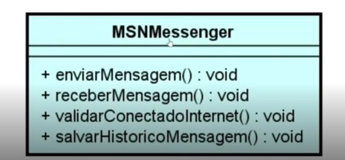

# Assuntos

- Conceito de POO
- Pacotes e Visibilidade de recursos
- Classes e Construtores
- Java Beans e UML
- Pilares do POO
- Enums e Interfaces

# Conceitos de POO

Á medida que a tecnologia vem evoluindo, as linguagens de programação também.

Linguagem de baixo nível --> Linguagem próximo as linguagens de máquina
Linguagem de alto nível  --> Disponibiliza proposta de sintaxe (forma de escrita) mais próxima da interpretação humana. Ex: Java, JavaScript, Python e C++.

Exemplo de Hello World

Python 

```
print("Hello, world");

```

Assembly 

```
; Exemplo de um Hello World em Assembly
; ld -m elf_i386 -s -o hello hello.o
section .text align=0

global _start

mensagem db 'Hello world', 0x0a

len equ $ - mensagem

_start:
    mov eax, 4 ;SYS_write
    mov ebx, 1 ;Número do file descriptor (1=stdout)
    mov ecx, mensagem ;Ponteiro para a string.
    mov edx, len ; tamanho da mensagem
    int 0x80

    mov eax, 1
    int 0x8

```
Em uma simples linha executa uma operação que em uma outra linguagem como Assembly utilizaria-se muitas linhas e com complexidade muito maiores.

## Programação estruturada 

Paradigma da programação que visa melhor clareza, a qualidade e o tempo de desenvolvimento de um programa de computador, fazendo uso das construções de fluxo de controle estruturado (if/then/else) e repetições (while e for), com estruturas de blocos e sub-rotinas.

# A programação estruturada 

Permite implementar algoritmos com estruturas sequênciais denominados procedimentos lineares que podem afetar valores de variáveis de escopo local ou global.

# A porgramação orientada a objetos

POO é um paradigma de programação baseado em conceito de "objetos" que podem conter dados dna forma de campos, conhecidos como atributose códigos na forma de procedimentos conhecido como métodos, permite abstrair cenários do mundo real e criar e converter em algoritmos de fácil compreenção e fácil reutilização.

# Em Java 

Os arquivos são distribuídos com extensão .java denominados classe.
As classes são compostas de:
Identificador, Caracteristicas e Comportamentos

```
    
    public class nomeClasse{

    }

```

- Classe (class) Representa a criação de objetos
- Identificador (identity) Propósito existencial
- Caracteristicas (states) Representam os atributos 
- Comportamentos (behavior) Ações ou métodos 
- Instanciar (new) Ato de criar um objeto a partir da estrutura definida da classe/objeto constroi um objeto que representa o contexto da classe.

Class Students --> states(atributos) --> behaviors --> (métodos/comportamentais)
--> instancias(new Students) --> contém uma represntação completa desse mapa.

# As classes correspondem a estrutura dos objetos.

Tipos de classes

- Classe de modelo(model) representam o domínio da aplicação ex: Cliente, Pedido etc...
- Classe de serviço (service) Contém as regras de negócio e validação de nosso sistema
- Classe de repositório (repository) Contém a integração com banco de dados.
- Classes de controle (controller) Disponibilizar alguma comunicação externa http/web/webseriveces/api(s).
- Classe utilitária (util) Contém recursos comuns à toda aplicação.

# Pacotes

Os pacotes ou (packages) É uma alternativa de organização do projeto com a finalidade de facilitar a busca por arquivos durante a manutenção do projeto.

Os packages sao sub-diretórios a partir da pasta src do projeto. 

Convensão/sugestão ao criar pacotes imaginando que a empresa chama-se PowerSoft

- Comercial: com.powersoft
- Governamental: gov.powersoft
- Código aberto: org.powersoft

Mediante a finalidade da classe criamos então os pacotes model, repository, service, controller etc.
Esses sub-pacotes por convensão serão criados 
ex: 
com.powersoft.model com.posersoft.service.Usuario
com.powersoft.controller.UsuarioController

A localização de uma classe é definida pela palavra reservada:

```
    package
    import ...
    import ...

    public class MinhaClasse{
        //atributos metodos e códigos.
    }

```

# Observação para trabalhar com o eclipse

Precisamos configurar a jdk em Window-->Preferences--> JRE Definition

# Modificadores 
Os modificadores estão relacionados a visibilidade das classes em todo o projeto dependendo do contexto.

Será que a classe que vou criar deve ser pública ou privada?

Cozinheiro --> Realiza várias tarefas ou ações que podem depender de outras classes

Almoxarife --> Controla enradas e saídas e trocar o Gaz do cozinheiro pode depender de outras classes como por exemplo do atendente

Atendente --> Serve a mesa, pega o pedido, recebe pagamento, troca gaz e pega pedido do balcão

Cliente --> Escolhe o lanche, faz pedido, paga a conta  e também pega o pedido no balcão

# Cada um no senário acima tem suas responsabilidades 

Estabelecimento --> Toda jornada por meio dos mecânismos disponíveis pelas demais classes que o estabelecimento consegue interagir em nossa aplicação.

Precisamos então definir as responsábilidades e visibilidades entre os recursos de nossa lanchonete.

Neste senário nem tudo precisará estar disponível (public) a todos.

Distribuindo melhor criando pacotes temos o projeto mais organizado

    package area.cliente.Cliene
    package atendimento.cozinha.Cozinheiro
    package atendimento.cozinha.Almoxarife

    package atendimento.Atendente

Utilizando os modificadores para restringir visibilidade entre Classes

Em nosso exemplo como definição no comentário o seguinte:

```
        //ações que somente o package cozinha precisa conhecer(default)
        almoxarife.entregarIngredientes();
        almoxarife.trocarGas();

```
Com a criação de pacotes e definindo os métodos default observamos que so métodos não ficam mais disponíveis em todo o sistema deixando de maneira segura as delegações ou acesso as tarefas.

# Visibilidades private

Será que o cozinheiro precisa saber que ou como o almoxarife controla as entradas e saídas?

E o cliente prcisa saber como o atendente recebe o pedido para servir a mesa?

O antendente precisa saber que antes de pagar o Cliente consulta o saldo no app?

Diante das questões é que nossas classes precisam manter ou não métodos disponíveis impróprios em alguns níveis hierarquicos

# Observação

A visibilidade de recursos da linguagem não está relacionada a interface gráfica, mas sim, o que as classes conseguem acessar.

Alterando a classe cozinheiro tornando alguns métodos privados, que não convém estar disponível em todo o estabelecimento.

# Observar sempre quem ou qual pacote seria interessante ter visibilidade os meus métodos.


# Getters and Setters 
São usados para buscarvalores de atributos ou definir novos valores em atributos.

# Construtores

Em Java segue-se uma convensão

[nome-classe] [nome-objeto] = new [Classe()]
Classe novoObjeto = new Classe();

O método construtor deverá ter o nome igual ao nome da classe e ser do tipo void
ou seja sem retorno.

```
    public class Pessoa {
    private String nome;
    private String cpf;
    private String endereco;

    public Pessoa(){ --> Construtor padrão quando não criamos ele já existe por default

    }
    
    public Pessoa(String cpf, String nome){ // -->Método construtor 
        this.cpf = cpf;
        this.nome =nome;
    }


    public String getNome() {
        return this.nome;
    }

    public void setNome(String nome) {
        this.nome = nome;
    }

    public String getCpf() {
        return this.cpf;
    }

    public void setCpf(String cpf) {
        this.cpf = cpf;
    }

    public String getEndereco() {
        return this.endereco;
    }

    public void setEndereco(String endereco) {
        this.endereco = endereco;
    }

}

```
Parcularidades utilizar o conceito: 

[this.nome] refere-se ao atributo nome da classe em questão 
this.nome = [nome]
[nome] refere-se ao nome que foi passado como parâmetro.

Quando criamos um construtora passando parâmetros informaçõe préviamente estabelecidas para a criação do objetos no exempolo acima 

```
    Pessoa marcos = new Pessoa("1234565","Marcos");
    marcos.setEndereco("Rua das Gaivótas, 55");

```
# Enums

Enum é um tipo especial de classe onde os objetos são previamente criados imutáveis e disponíveis pro toda a aplicação.

Usamos Enum quando nosso modelo de negócio contém objetos de mesmo contexto que já existm pré-estabelecida com a certeza de não haver muitas alterações de valores.

Ex: 
- Grau de Escolaridade: Analfabeto, Fundamental, Médio, Superior etc...
- Estados de um país que são pré estabelcidos a probabilidade de mudar algum estado é mínima.
- Estado Civil: Solteiro, Casado, Divorciado, Viúvo....

# Observação não confundir listas de objetos com enums

Enum é um conjunto de objetos que podem conter atributos e métodos.

Enum no contexto de Estados Brasileiros por exemplo conterá 27 objetos do tipo estado 
Não são variáveis são ojbetos pré estabelecidos.

```
    public enum EstadoBrasileiro{
        SAO_PAULO ("SP", "São Paulo");
        RIO_JANEIRO("RJ","Rio de Janeiro");
        //continua....

        private String nome;
        private String sigla;

        public EstadoBrasileiro(String sigla, String nome){
            this.sigla = sigla;
            this.nome = nome;

        }

        public String getSigla(){
            return this.sigla;
        }

        public String getNomeMaiusculo(){
            return nome.toUpperCase();
        }

    }
```

# Observação Enums são para valores pré estabelecidos que não sofream alterações de valores periodicamente.

# UML 

DIAGRAMAÇÃO EM ANÁLISES PARA INTERPRETAR COM FACILIDADE 

UML(LINGUAGEM DE MODELAGEM UNIFICADA) é uma representação gráfica do projeto.

# Diagramas estruturais

- Diagrama de classes --> Ilustra gráficamente como as classes estarão relacionadas entre si, utilizando as regras de criação de classe.

Associação de classes define um relacionamentro entre elas

CLASSE A ------> CLASSE B - (ASSOCIAÇÃO SIMPLES)
CLASSE A <-----> CLASSE B - (ASSOCIAÇÃO BIDIRECIONAL AS DUAS CLASSES PRECISAM SE ENXERGAR)

CLASSE A <>----> CLASSE B - AGREGAÇÃO  (A CAPACIDADE QUE EU DETERMINO QUE EXISTA UMA RELAÇÃO E A CLASSE É AGREGADA A CLASSE A)

CLASSE A <>====> CLASSE B - COMPOSIÇÃO (A DEPÊNDENCIA REAL DE UMA CLASSE COM A OUTRA)
 
 AGREGAÇÃO: A classe principal contém uma relação com outra classe, mas ela pode existir sem a classe agregadora. Exemplo podemos ter candidatos que ainda não possuem profissão.


 COMPOSIÇÃO: A classe principal compõe a outra classe ela depende da existência da outra classe. Não faz sentido Admissão sem um candidato.


# Multiplicidade em UML

Nem sempre o relacionamento é um para um, o relacionamento pode ser:

*.-> Representa uma associação contendo uma lista de elementos
*..1 -> Representa uma associação contendo zero ou um elemento
0..* -> Representa uma associação contendo zero ou uma lista de elmentos
1..* -. Representa uma associação contendo um ou uma lista de elementos depende ao menos de um elemento.

Podemos também limitar no diagrama por exemplo 1..3

# Visibilidade representada em UML

(+) Visibilidade pública --> no Java public em UML (+)
(#) Visibilidade protegida --> (muito associada com herança) no Java protected
(-) Visibilidade privada --> no Java private no UML(-)


O diagrama UML dá a direção do que desenvolver com a leitura de simbolos, como se fosse uma planta de um prédio da (engenharia civil) temos a planta da engenharia de software.
  

[DESENHAR ON-LINE UML](https://app.diagrams.net/)

# Pilares da POO

Programação orientada a objetos POO em inglês OOP é um paradigma de programação baseado em conceitos de objetos que podem conter dados na forma de campos conhecidos como atributos, e códigos na forma de procedimentos, conhecidos como métodos.

É um contexto análogo do mundo real, tudo o que referimos sao objetos.
Conta bancária, Aluno, Veículo, Transferência, Frutas entre outras.

A Orientação a objetos está no contexto das aplicações atuais, por causa da reutilização e reaproveitamento de códigos.

# Encapsulamento: 

Nem tudo precisa estar acessível ou visível, grande parte do nosso algoritmo pode ser distribuido em métodos com finalidades específicas que no exemplo de ligar um veículo exige muitas etapas para a engenharia , mas para o condutor só vê a ignição, dar partida é a magia.

# Herança:

# Características e comportamentos comuns podem ser elevados e compartilhados através de uma hierarquia de objetos.
Ex: Um carro ou motocicleta possuem propriedades como chassi, ano fabricação e métodos acelerar, frear. Logo poderiamos criar uma classe Veículo para herdar por Carro e Motocicleta.

# Abstração: É a indisponibilidade para determinar a lógica de um ou mais comportamentos:
Exempolo a classe genérica Veículo determina duas ações como acelerar e frear. logo estes comportamentos deverão ser abstratos pois existem mais de uma maneira de realizar a mesma operação. 


# Polimorfismo esta associado a vários ou inúmeras alternativas para se realizar um comportamento.

Inúmeras maneiras de se realizar a mesma ação. Cada tipo de veículo de sua forma polimorfica determina a lógica de aceleraração e franagem dos respectivos veículos.

Primeiro ponto do encapsulamento é verificar quais métodos devem ser escondidos para a classe principal.

# No exemplo utilizado o 1º Ponto do Encapslamento

Carro.java e Autodromo.java

```
package PolimorfismoHerancaEncapsulamento;

public class Autodromo {
    public static void main(String[] args) {
        Carro jeep = new Carro();
        
        jeep.ligar();
    }
    
}
```
Utilizando o Encapsulamento --> Retiramos os métodos conferirCambio() e verificarCombustivel() e alteramos na classe Carro para private esses métodos, e os inserimos no método ligar dentro da própria classe Carro.

# Na Herança precisamos identificar quais métodos são repetidos em vários Objetos
Exemplo:

As classes Carro e Moto, tem muita coisa em comum, nº chassi, placa etc...
Teriamos que implementar métodos repetidos nas duas classes então utilizamos Hernaça criando uma classe Veiculo que contém esses atributos e nas classes Carro e Moto extendemos a classe Veiculo e consequêntemente teremos os métodos getChassi e getPlaca disponíveis, porém implementados em apenas um lugar no caso a classe Veiculo.

# Abstração Observando as duas classes

Carro e Moto notamos que ainda os dois possuem o método ligar()
Sabemos que um carro e uma moto são ligados de uma forma diferente do ponto de vista conceitual.

# Abstração o abstract 

Todo veículo vai ter o método ligar, porém quem quiser ser um veiculo terá que abstrair a maneira como isso deve acontecer.
Para isso criamos métodos abstract 

ex:
# Na abstração nota-se que temos um único comportamento, mas com comportamentos difrentes.

```
    package HerancaJava;

public abstract class Veiculo { // ==> tornamos a classe abstata
    private String chassi;
    private String placa;

    public void setChassi(String chassi) {
        this.chassi = chassi;
    }

    public String getPlaca() {
        return this.placa;
    }

    public void setPlaca(String placa) {
        this.placa = placa;
    }

    public abstract void ligar(); // -> criamos o método abstract ligar
    
    
}

```

# Praticando

A imagem abaixo ilustra o senário para a implementação



Observando a imagem notamos que temos: 
A classe dispõe do nome MSNMessenger
+enviarMensagem():void (a classe contém vários métodos publico(+) e sem retorno(void), bem como os demais métodos também).
Não contém atributos no momento.

# Treinando o Encapsulamento

Analisando o senário 1 

Ao instalarmos o MSN e ao querer enviar uma mensagem, fosse solicitado que verificassemos a conexão com a internet e depois, pedir pra você salvar a mensagem no histórico? 
Ao enviar um SMS pelo celular primeiro você precisasse consultar manualmente o saldo?

# OBS: Nem tudo precisam estar disponíveis ao usuário.


Então vem as perguntas

Todos os métodos são publicos?

Todos os métodos precisam estar visíveis?

# Com as observações notamos que os dois métodos da imagem acima precisam ser alterados no diagrama trocando o sinal de (+) para o de (-), pois precisamos alterar os modificadores na hora da implementação.

# Observe as alterções abaixo, depois de ter feito as refatorações, ainda antes da implementação:


Aglomeramos então os métodos que não convém para serem executados dentro da própria classe, tornando-os private.

# Os métodos devem ser bem definidos, para uma melhor visualização no momento da implementação.

# HERANÇÃ 2º Pilar da OO


# Imaginando que em uma entrevista fosse requistado que implemtassemos o diagrama abaixo.


## Observamos na imagem acima, existem três classes com métodos muito parecidos

Em um primeiro momento poderiamos ter a idéia de construir as três classes com seus respectivos métodos e beleza! Mas não é bem isso quando trata-se de POO.

Além da capacidade de interpretação de um diagrama é necessário ter domínio dos pilares da POO e aplica-los em situações iguais a esta.

# NOTE: TODAS AS CLASSES POSSUEM A MESMA ESTRUTURA COMPORTAMENTAL, E DIANTE DISSO ESTE CONTEXTO SE ENCAIXA PERFEITAMENTE O SEGUNDO PILAR DA POO, A HERANÇA.

# SOLUÇÃO:

Será que todos os sistemas de mensagens realizam as mesmas operações da mesma maneira? Ai entra os pilares da 

# Abstração e Polimorfismo e refatoração de códigos.

# Observação utilizando a herança elevamos os métodos para todas as classes, mas isso não é o suficiente, mas neste caso os serviços de mensagens distintos cada um tem sua lógica de envio de mensagens

Então em resumo precisaremos entrar com a abstração e polimorfismo...

Tornando nossa classe ServicoMensagemInstantanea abstrata, cada Servico de mensagem criado será obrigado a implementar os métodos conforme suas peculiaridades. É criado então um contrato com quem implementar ServicoMensagemInstantanea (serviço pai).

Transferimos a responsabilidade para a classe que vai extender essa classe implementar sua própria maneira de enviar ou receber mensagens.

Criar uma classe genérica abstract com todos os métodos, e utilizar nas demais classes

# Determina-se que a classe abstrata "abstract" tem métodos que não tem corpo {}

# APLICANDO O POLIMORFISMO 
(POLIMORFISMO) TEMOS UM OBJETO ABSTRATO QUE NÃO TEM CONHECIMENTO DE COMO AS COISAS ACONTECEM.

# O polimorfismo está muito associado ao Modificador protected 

Lembrando que nos requisitos do sistema de mensagens notamos que além do envio e recebimento das mensagens precisamos validar se o aplicativo está:

está conectado
tem saldo
salva em histórico

Ao salvar os históricos cada aplicativo salva em seus respectivos servidoes.

# Mas gostariamos que somente as classes filhas soubessem dos métodos verificar conexão etc... Ai entra o protected, mas não o bastante devemos organizar os pacotes, caso contrário teremos visibilidade ainda que com o protected no método verificarConexão.


```
//Somente os filhos conhecem esse método
    protected void validarConectadoInternet() {
        System.out.println("Validando a conexão ");
    }

/*todos os filhos são obrigados a implemntar de sua maneira lembrando que somente dentro de um mesmo pacote package existe essa visibilidade.*/
    public abstract void enviarMensagem();

//Observação a classe também deverá ser abastact.

```

# INTERFACES (Java) Não estamos referindo a interace gráfica e sim a um conceito de abstração dentro da linguagem Java.

É um nível mais avançado apara abastração são 
contratos que precisam ser definidos. 

# abstract
Veiculo pode ser um carro uma moto etc..

# Interfaces 
O mesmo objeto ter propriedades e papeis diferentes em uma mesma app.

# A linguagem Java não permite HERANÇA Múltipla por questões de segurança.

class a extends b, c { --> Errado

}

class implements b,c {

}

# A medida que surgem necessidades, novos equipamentos (objetos) nascem para atender as expectativas de oferecer ferramentas, finalidades bem específicas como por exemplo:

Impressoras, Digitalizadoras, Copiadeoras etc...

Observe que não há uma expecificação de marca, modelo ou capacidade de execução das classes citadas acima, isto é o que consideramos o nível mais abstrato da orientação a objetos denominados de Interfaces.

Impressora --> copiadora --> digitalizador

Pode ser impressora de várias marcas
Pode ser copiadoras de várias marcas
Pode ser digitalizador de várias marcas

Criar uma classe EquipamentMultiFuncional para testar o uso de interfaces já que por motivos de segurança Java não permite extender várias classes


# Quando percebemos que existe a necessidade ter características que represntam outras classes essas deverão ser Interfaces. 

## Esse é o nível mais alto da abstração em Java

Temos que:

Na na impressora multifuncional eu posso
Imprimir, copiar e digitalizar

# Observando o diagrama de classes abastract abaixo:
senário 1.


# Observando o diagrama com Interfaces
senário 2.


Notamos que quando eu digo que tenho o conceito de interfaces minhas classes podem extender minhas interfaces e implementar conforme suas necessidades.

Trazemos então a Herança multipla baseada em Interfaes.


